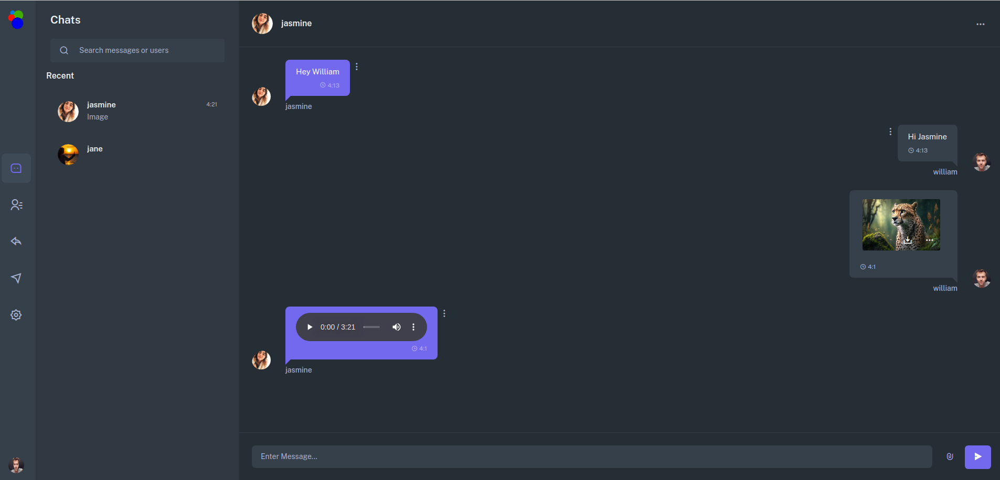
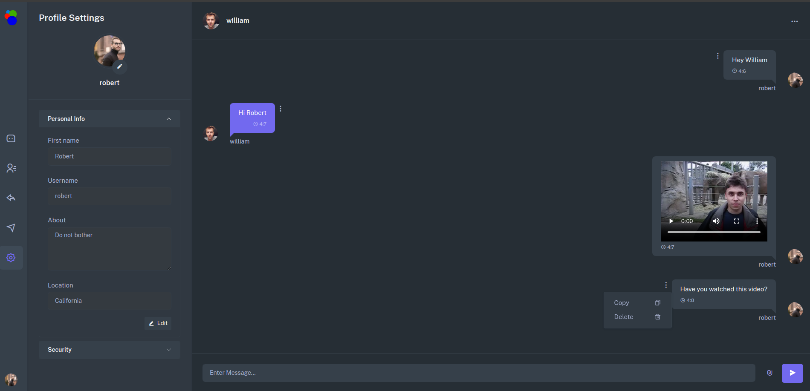

# Django ChatAPP
<div>
     <br> <br>
    
</div>

## Description
The purpose of my project is that users can chat with their friends online.
<br>
Users can add friends and chat with them online. In the chat, users can share photos, videos, audio and documents with each other. There is a user reporting system.
<br>
I used the Django framework of the Python programming language in the backend of the project. I used Django channels for real-time asynchronous messaging.
<br>
I used javascript and jquery on the frontend.


## Installation

```bash
git clone https://github.com/ibrahimmuradov/django_chatapp.git .
pip install -r requirements.txt
django-admin startproject core . 
py manage.py migrate
py manage.py createsuperuser
py manage.py runserver
```
